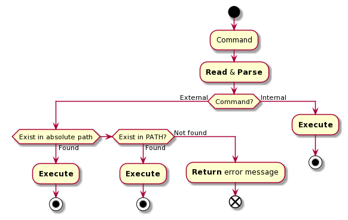

# SHELL Project

> Based on C99 & Linux.  
> Maintainer: Sébastien HUG DE LARAUZE ([GitHub](https://github.com/SebastienHUGDELARAUZE/ue-os-project))  
> Educator: Eric TOTEL (IMT Atlantique)

## Usages

- To build the project, you can use the makefile task `build`:

      $ make build
      gcc ...

  > Will produce an executable called `main`

- To clean the project afterward, use the task `clean`:

      $ make clean
      rm ...

## Specifications

- [ ] **FEAT-1**: managed variables
  - [ ] **VAR**: affect value: `var=string`
  - [ ] **VAR**: affect value: `var="composed string"`
  - [ ] **VAR**: access value: `$var`
- [ ] **FEAT-2**: parse command
  - [x] **PARSE**: ` ` "space": command line delimiter, except inside string (`" "`)
- [ ] **FEAT-3**: execute command
  - [ ] **EXEC-CMD**: internal command
    - [ ] **INT-CMD**: `echo`
    - [ ] **INT-CMD**: `pwd`
    - [ ] **INT-CMD**: `addpath [path]`
    - [ ] **INT-CMD**: `delpath`
    - [ ] **INT-CMD**: `showpath`
  - [ ] **EXEC-CMD**: external command (available in system tree)
    - [ ] **EXT-CMD**: Determined by absolute path
    - [ ] **EXT-CMD**: Determined by internal variable path research
    - [ ] **EXT-CMD**: Return error message for unavailable command
- [ ] **FEAT-4**: Output redirection
  - [ ] **REDIR**: `>`: redirect output to file (overwrite)
  - [ ] **REDIR**: `>>`: redirect output to file (append)
  - [ ] **REDIR**: `|` "pipe": redirect left command output to right input command
- [ ] **FEAT-5**: Background task
  - [ ] **BACKG**: `&`: Create background task

### Use case

- [ ] Case: Command with/without arguments

- [ ] Case: End result

      > delpath
      > addpath /bin
      > addpath /usr/local/bin
      > showpath
      /bin:/usr/local/bin
      > fichier="mon fichier.txt"
      > touch $fichier fichier2.txt
      > ls -al $fichier
      > ls -al > resultat.txt
      > ls -al | grep fichier
      [mon fichier.txt & fichier2.txt]

### Test case

#### FEAT-1 | VAR

- [ ] [**REQUIRED**] Assign and access word value

      > var=IMT  
      > echo $var  
      IMT

- [ ] [**REQUIRED**] Failed to assign string value

      > var=IMT Atlantique
      Atlantique: command not found

- [ ] [**REQUIRED**] Assign and access string value

      > var="IMT Atlantique"
      > echo $var
      IMT Atlantique

#### FEAT-3 | EXEC-CMD

- [ ] [**REQUIRED**] Execute external command (w/o args)

      > /bin/ls
      [folder content]

- [ ] [**REQUIRED**] Execute external command (w/ args)

      > /bin/ls -al
      [folder content]

- [ ] [**REQUIRED**] Execute external command (w/ args & path lookup)

      > ls -al
      [folder content]

#### FEAT-4 | REDIR

- [ ] [**REQUIRED**] Redirect to file (overwrite)

      > ls -al > fichier.txt
      > cat fichier.txt
      [folder content]

- [ ] [**REQUIRED**] Redirect to file (append)

      > ls -al >> fichier.txt
      > cat fichier.txt
      [folder content]

- [ ] [**REQUIRED**] Redirect to file (append)

      > ls -al | grep e
      [folder content filtered by letter 'e']

#### FEAT-5 | BACKG

- [ ] [**REQUIRED**] Execute a command in background

      > ls &
      [PID]

## Notes

Sources:

- [Python module: subprocess manager **Pexpect**](https://pexpect.readthedocs.io/en/stable/index.html)
- [Python module: test framework **PyTest**](https://docs.pytest.org/en/stable/contents.html)

Files of interest:

- `grammar.y`
- `syntax.flex`
- `shell.c`
- `shell.h`
