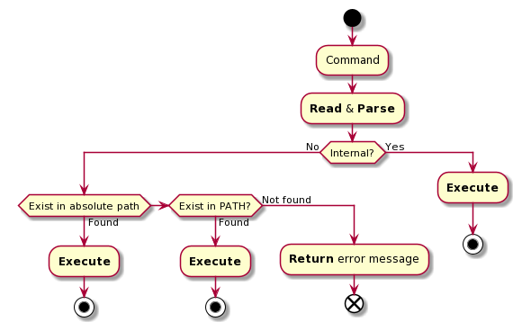

# Test specifications

## Use case

- [x] Case: Command with/without arguments

- [ ] Case: End result

      > delpath
      > addpath /bin
      > addpath /usr/local/bin
      > showpath
      PATH=/bin:/usr/local/bin
      > fichier="mon fichier.txt"
      > touch $fichier fichier2.txt
      > ls -al $fichier
      > ls -al > resultat.txt
      > ls -al | grep fichier
      [mon fichier.txt & fichier2.txt]

## Test case

### FEAT-1 | VAR

- [x] [**REQUIRED**] Assign and access word value

      > var=IMT  
      > echo $var  
      IMT

- [x] [**REQUIRED**] Failed to assign string value

      > var=IMT Atlantique
      Atlantique: command not found

- [x] [**REQUIRED**] Assign and access string value

      > var="IMT Atlantique"
      > echo $var
      IMT Atlantique

### FEAT-3 | EXEC-CMD

- [ ] [**REQUIRED**] Execute external command (w/o args)

      > /bin/ls
      [folder content]

- [ ] [**REQUIRED**] Execute external command (w/ args)

      > /bin/ls -al
      [folder content]

- [ ] [**REQUIRED**] Execute external command (w/ args & path lookup)

      > ls -al
      [folder content]

### FEAT-4 | REDIR

- [ ] [**REQUIRED**] Redirect to file (overwrite)

      > ls -al > fichier.txt
      > cat fichier.txt
      [folder content]

- [ ] [**REQUIRED**] Redirect to file (append)

      > ls -al >> fichier.txt
      > cat fichier.txt
      [folder content]

- [ ] [**REQUIRED**] Redirect to file (append)

      > ls -al | grep e
      [folder content filtered by letter 'e']

### FEAT-5 | BACKG

- [ ] [**REQUIRED**] Execute a command in background

      > ls &
      [PID]
