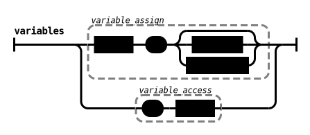
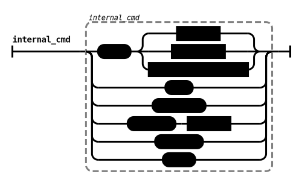
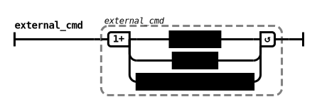

# Project specifications

> [School subject](doc-files/pdf/requirements.pdf)

## Requirements

- **FEAT-0**: Parse command
  - **-PARSE**: space character used as command line delimiter, except inside string (`" "`)
- **FEAT-1**: Manage variables
  - **-VAR-1**: affect value: `var=word`
  - **-VAR-2**: affect value: `var="string"`
  - **-VAR-3**: access value: `$var`
- **FEAT-2**: Execute command
  - **-INT-CMD**: internal command
    - **-ECHO**: `echo`
    - **-PWD**: `pwd`
    - **-PATH-1**: `showpath`
    - **-PATH-2**: `addpath [path]`
    - **-PATH-3**: `delpath`
  - **-EXT-CMD**: External command (available in system tree)
    - **-SEARCH-1**: determined by absolute path
    - **-SEARCH-2**: determined by internal variable path research
    - **-ERROR**: return **error** message for unavailable command
- **FEAT-3**: Command handlers
  - **-REDIR-1**: `>`: redirect output to file (overwrite)
  - **-REDIR-2**: `>>`: redirect output to file (append)
  - **-REDIR-3**: `|` "pipe": redirect left command output to right input command
  - **-BACKG**: `&`: Create background task

## Shell **PARSER** Definition


>   
>   
>   

## Shell **SCANNER** Definition

> Token specification:  
> `TOKEN_NAME` - Regex: `regular expression`

- `EOL` - Regex: `\n`
- `BLANK` - Regex: `[ \t]` _(Activation uniquement lors de la détection d'une variable)_

### VARIABLE TOKENS

- `ASSIGN` - Regex: `=`
- `ACCESS` - Regex: `$`

### COMMAND TOKENS

- `CMD_ECHO` - RegEx: `echo`
- `CMD_PWD` - RegEx: `pwd`
- `CMD_SHOWPATH` - RegEx: `showpath`
- `CMD_ADDPATH` - RegEx: `addpath`
- `CMD_DELPATH` - RegEx: `delpath`

### HANDLER TOKENS

- `REDIR_OVER` - RegEx: `>`
- `REDIR_APP` - RegEx: `>>`
- `REDIR_CMD` - RegEx: `|`
- `BACKG` - RegEx: `&`

### TOKEN: **{word}**

- name: `WORD`
- RegEx: `[[:alnum:]_]+`  
![WORD RegEx: [a-zA-Z0-9_]+](doc-files/img/regex-WORD.svg)

### TOKEN: **{id}**

- name: `ID`
- RegEx: `[[:alpha:]_][[:alnum:]_]*`  
![ID RegEx: [a-zA-Z_][a-zA-Z0-9_]*](doc-files/img/regex-ID.svg)

### TOKEN: **{string}**

- name: `STRING`
- RegEx: `\"[[:alnum:][:blank:]/_]+\"`  
![STRING RegEx: \"[a-zA-Z0-9\t\ \/_]+\"](doc-files/img/regex-STRING.svg)

### TOKEN: **{path}**

- name: `PATH`
- RegEx: `[[:alnum:]_/.]+`  
![PATH RegEx: [a-zA-Z0-9_\/.]+](doc-files/img/regex-PATH.svg)

### TOKEN: **{command}**

- name: `CMD`
- RegEx: ``` \`[[:alnum:][:blank:]/_]+\` ```  
![COMMAND RegEx: \`[a-zA-Z0-9\t\ \/_]+\`](doc-files/img/regex-COMMAND.svg)

### TOKEN: **{arg}**

- name: `ARG`
- RegEx: `-[[:alpha:]]+`  
![ARG RegEx: \-[a-zA-Z]+](doc-files/img/regex-ARG.svg)
